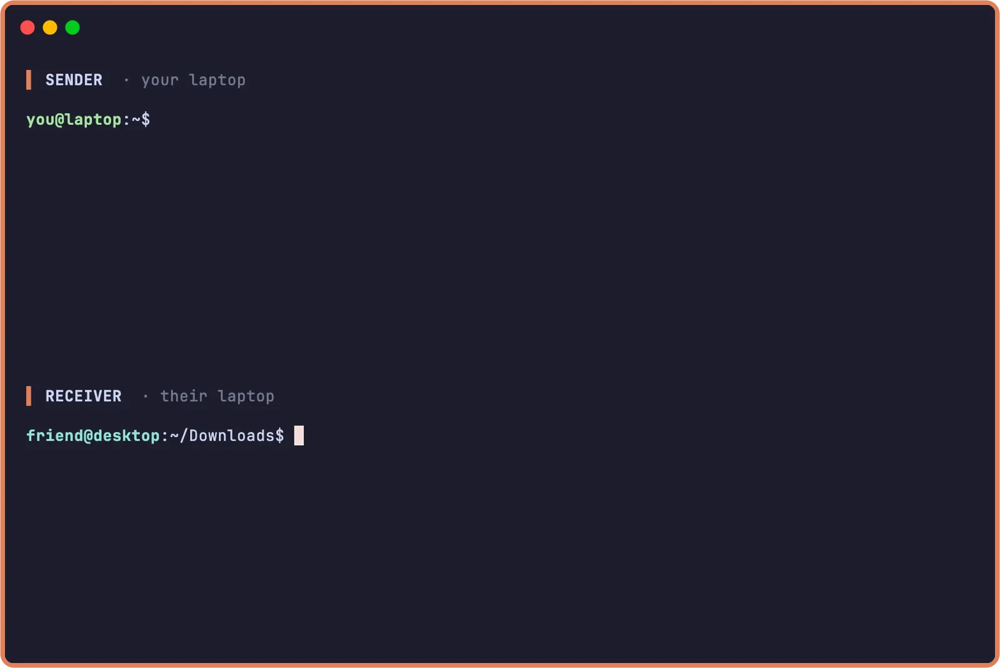

<p align="center">
  <picture>
    <source media="(prefers-color-scheme: dark)" srcset="docs/assets/icon-dark.svg">
    
  </picture>
</p>

<p align="center"><strong>Peer-to-peer, end-to-end encrypted file transfer.</strong></p>

<p align="center">
  <a href="https://github.com/polius/fsend/actions/workflows/checks.yml"></a>
  <a href="https://github.com/polius/fsend/releases"></a>
  <a href="LICENSE"></a>
</p>

<p align="center">
  ', accepts, and the file lands in ~/Downloads.">
</p>

<p align="center"><em>One command to send, one to receive — your bytes go straight between the two machines, end-to-end encrypted.</em></p>

## About

fsend is a **command-line tool** that lets any two computers transfer files **straight to each other** — no accounts, no cloud, no third party storing the file.

- **Peer-to-peer** — bytes go straight from sender to receiver at your own internet speed (relay only as a fallback)
- **End-to-end encrypted** — TLS 1.3 between the peers, authenticated by the share code (PAKE); even the fallback relay never sees the file
- **No ports to open** — works on any network, no router or firewall setup
- **Send anything** — files, folders, multiple at once, stdin streams, or literal text
- **Resumable** — connection drops? Rerun the same command and fsend picks up where it stopped
- **Skips what's already there** — re-send a folder and the files already on the other side are skipped automatically
- **Password-protected** — gate any transfer with `--pass`; receiver supplies it to unlock
- **Post-quantum** — X25519 + ML-KEM-768 (NIST); designed so future quantum computers can't decrypt today's transfers
- **Self-hostable** — deploy your own pairing server + relay with Docker compose (Caddy for TLS)
- **Runs anywhere** — single static binary on Linux, macOS, FreeBSD, Windows; x86 and ARM

## Install

**Linux, macOS, FreeBSD** — x86 and ARM:

```bash
curl -fsSL https://getfsend.alzina.dev | sh
```

**Windows** — run this in PowerShell:

```powershell
irm https://getfsend.alzina.dev/install.ps1 | iex
```

Both installers verify the release's SHA-256 checksum before installing.

<details>
<summary>Other install methods</summary>

From source:

```bash
go install github.com/polius/fsend/cmd/fsend@latest
```

Or grab a release binary from [the releases page](https://github.com/polius/fsend/releases).

</details>

## Examples

**Send** a file — fsend hands you a share code:

```console
$ fsend report.pdf
  Sending report.pdf  ·  1 file  ·  2.4 MB

  On the other machine, run:

      fsend abc-defg-jkm
```

**Receive** — run that code, and the file lands in the current folder:

```console
$ fsend abc-defg-jkm
```

More ways to send:

```bash
fsend ./project                    # a whole folder
fsend a.txt b.txt c.txt            # several at once
pg_dump mydb | fsend               # a stream from stdin
fsend --text "wifi: hunter2"       # a literal string
fsend report.pdf --pass            # gated behind a password
```

…and to receive:

```bash
fsend --yes abc-defg-jkm              # skip the confirmation prompt
fsend --out ~/Downloads abc-defg-jkm  # save to a specific folder
```

## Documentation

| | |
|---|---|
| [How it works](docs/architecture.md) | Three transfer modes, raced concurrently — and why |
| [Security](docs/security.md) | Threat model — what the server can and cannot see |
| [Usage](docs/usage.md) | Every flag, env var, and exit code |
| [Self-hosting](docs/self-hosting.md) | Run your own pairing server in three steps |
| [Development](docs/development.md) | Build and test from source |

## Comparison

**[fsend vs croc vs magic-wormhole](docs/comparison.md)** — a side-by-side
table on data path, cryptography, codes, and features.

## Contributing

Bug reports and pull requests welcome — see [Development](docs/development.md) to build from source, or open an [issue](https://github.com/polius/fsend/issues).

## License

MIT
